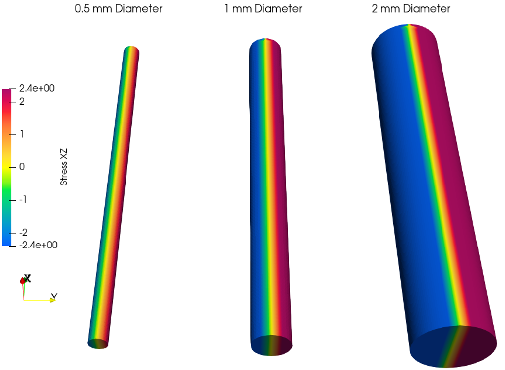
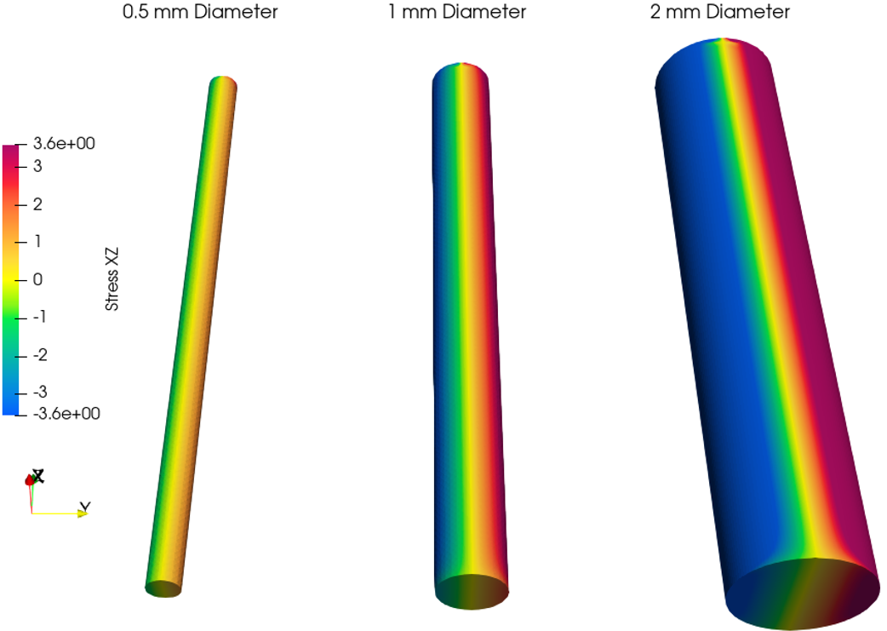
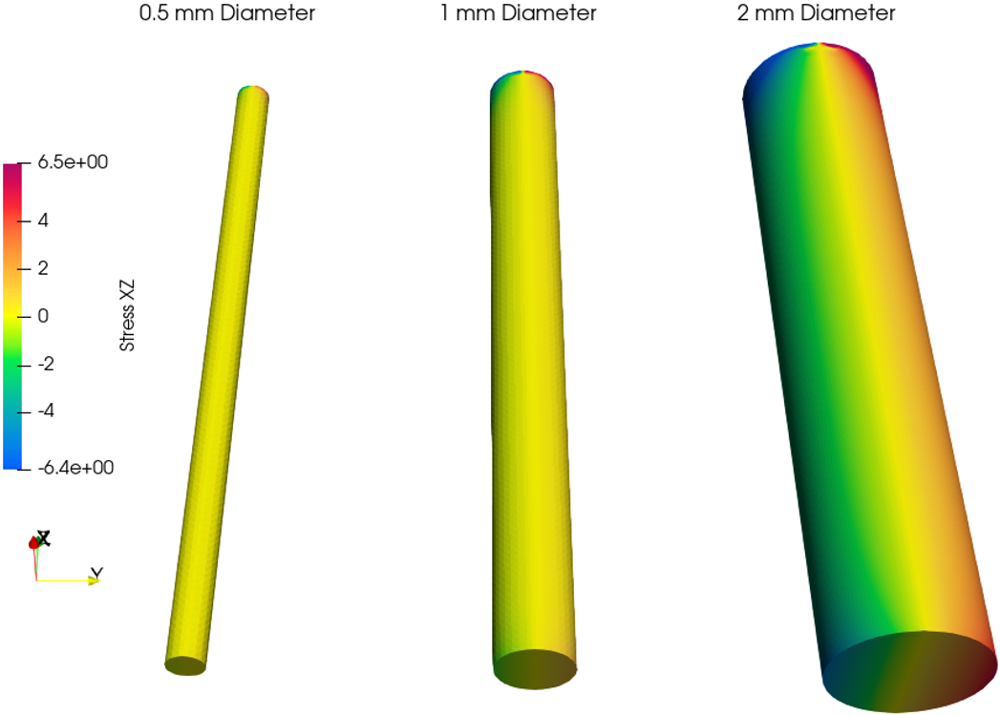
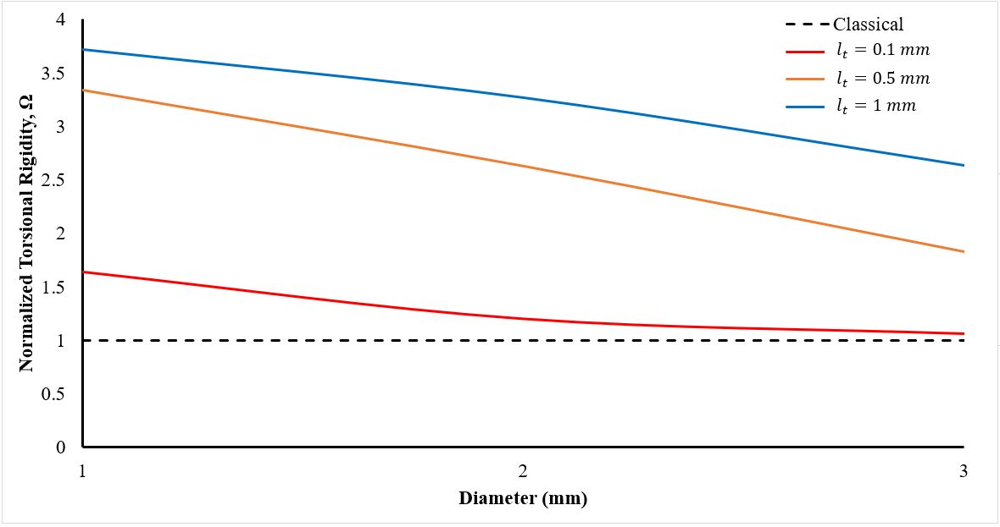

# Ryan Barrage, PhD
### Systems Architect • Gameplay Programmer • Computational Researcher

A researcher-turned-developer with a background in **Mathematical Physics** and **Computational Mechanics**. I specialize in building robust, high-consequence systems - from deriving 6-DOF constitutive material models to architecting authoritative multiplayer backends.

---

## Featured Game Projects

### **Celestica | Full-Stack TCG**
*A globally networked 1v1 trading card game with a server-side logic engine built in Unity.*
* **Architecture:** Authoritative server-client model (DigitalOcean/MongoDB).
* **Key Feature:** Custom **Minimax AI** for solo play and a persistent deck-building database.
* [**Visit Project Site (celesticatcg.com)**](https://celesticatcg.com/)

### **Express Checkout | Co-op Infrastructure**
*4-player online co-op featuring dynamic server orchestration.*
* **Technical Highlight:** Engineered a dedicated **Game Server Spawner** to spin up match instances on demand.
* **Systems:** Procedural supermarket generation and session-based matchmaking logic.

---

## Computational Research

### **Framework: Cosserat Elasticity in Functionally Graded Composites**
*Developed a non-classical Finite Element framework to simulate size-dependent behavior in exponentially graded isotropic materials.*

* **6-DOF Constitutive Logic:** Derived and implemented a material model for exponentially graded materials within the framework of **Cosserat (Micropolar) Elasticity**.
* **Numerical Implementation:** Authored a custom **User Element (UEL)** in Fortran for Abaqus, capturing 3 translational and 3 rotational degrees of freedom per node to model microstructural influence.
* **Data Engineering:** Engineered a Python utility to bridge raw solver output with **Paraview (VTK)** for advanced volumetric field analysis.

#### **Numerical Analysis: Torsional Size Effects**
The following figures demonstrate the transition from classical elasticity to size-dependent behavior as the internal length scale ($l$) begins to dominate the structural response.

| Fig 1: Classical ($l = 0$mm) | Fig 2: Cosserat ($l = 0.1$mm) | Fig 3: Cosserat ($l = 1.0$mm) |
| :---: | :---: | :---: |
|  |  |  |

***Fig 4:** Influence of structural diameter on normalized torsional rigidity, numerically confirming the "Size Effect" phenomenon.*

### **Automation: GFRP Reinforced Concrete Systems**
*Conducted non-linear FEA to evaluate the performance of glass-fiber-reinforced polymer (GFRP) beams.*

* **Large-Scale Automation:** Orchestrated **300+ unique Abaqus simulations** investigating a wide range of slenderness ratios ($a/d$).
* **Pipeline:** Developed a Python-driven parametric pipeline for job submission, and result extraction (Python-XLSX).

#### **Selected Publications & Thesis**
* [**PhD Thesis:** Finite Element Modelling of Functionally Graded Composites... (University of Waterloo)](https://uwspace.uwaterloo.ca/).
* [**Master's Thesis:** FEA of GFRP Reinforced Concrete Beams (University of Waterloo)](https://uwspace.uwaterloo.ca/handle/10012/10850).
* [Finite Element Modelling of Exponentially Graded Composites with Microstructure](https://journals.sagepub.com/doi/full/10.1177/10812865221147858).
* [Influence of Microstructural Characteristic Torsion Length on Exponentially Graded Cylinders in Torsion](https://link.springer.com/article/10.1007/s00707-022-03436-8).
* [Flexural and Shear Behaviours of GFRP-Reinforced Concrete Beams Based on Nonlinear Finite Element Studies](https://cdnsciencepub.com/doi/abs/10.1139/cjce-2022-0179).

---

## Technical Repertoire
* **Languages:** C# (Intermediate/Advanced), Python (Intermediate), SQL (Intermediate), Fortran (Basic).
* **Tools:** Unity, MongoDB, DigitalOcean, Abaqus, Paraview, Inkscape.
* **Specialties:** Networked Multiplayer, Systems Design, Numerical Modeling, TCG Mechanics.

---

## Contact
* **GitHub:** [RyanBarrage](https://github.com/RyanBarrage)
* **Email:** [ryan.barrage@gmail.com](mailto:ryan.barrage@gmail.com)
